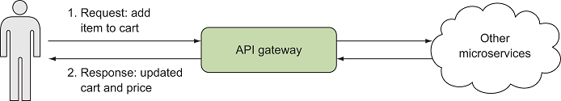
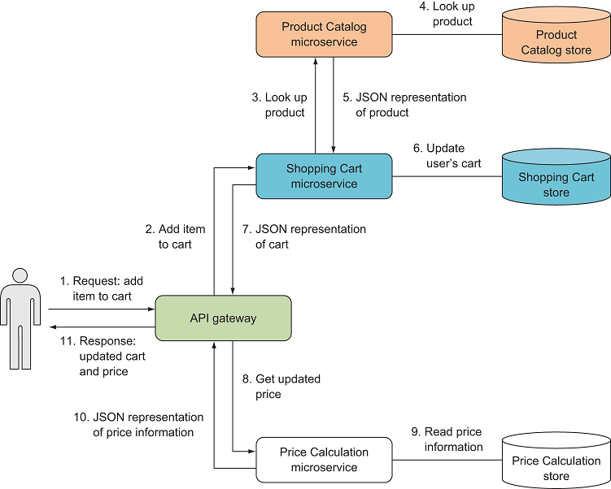

1. 网关
   

当前端代码请求将商品添加到购物车时，它仅与API Gateway微服务通信。网关后面发生的情况不可见

+ API Gateway微服务仅负责对传入请求的粗略验证。验证之后，首先将工作委派给购物车微服务，然后再委派给价格计算微服务。

+ 购物车微服务使用另一个微服务（产品目录微服务）来查找有关要添加到购物车中的商品的必要信息。然后，购物车将用户的购物车信息存储在其自己的数据存储中，并将更新后的购物车的表示形式返回到API网关。出于性能和健壮性的原因，“购物车”可能会缓存“产品目录”微服务的响应。
  

+ 价格计算微服务使用电子商务网站的当前业务规则来计算用户购物车中商品的总价格，并考虑任何适用的折扣
  
2. 网关使用示例
   
   

   进行协作以满足用户请求的每个微服务都具有单一的，侧重于目标的功能，并且对其他微服务的了解尽可能少。例如，购物车微服务对定价或价格计算微服务一无所知，对产品如何存储在产品目录微服务中一无所知。***这是微服务的核心：每个微服务都有一个责任***。
3.  