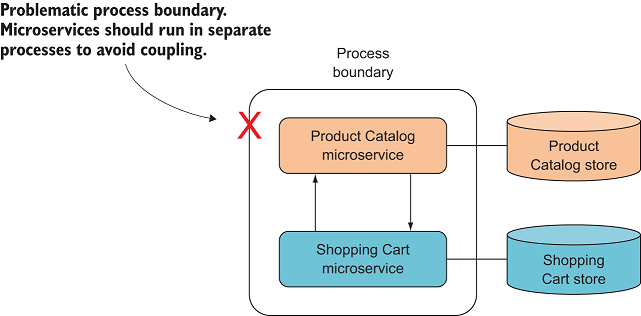
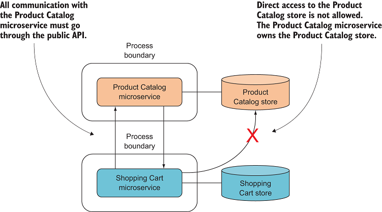
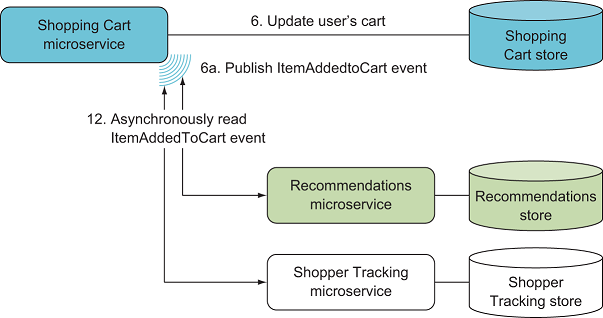
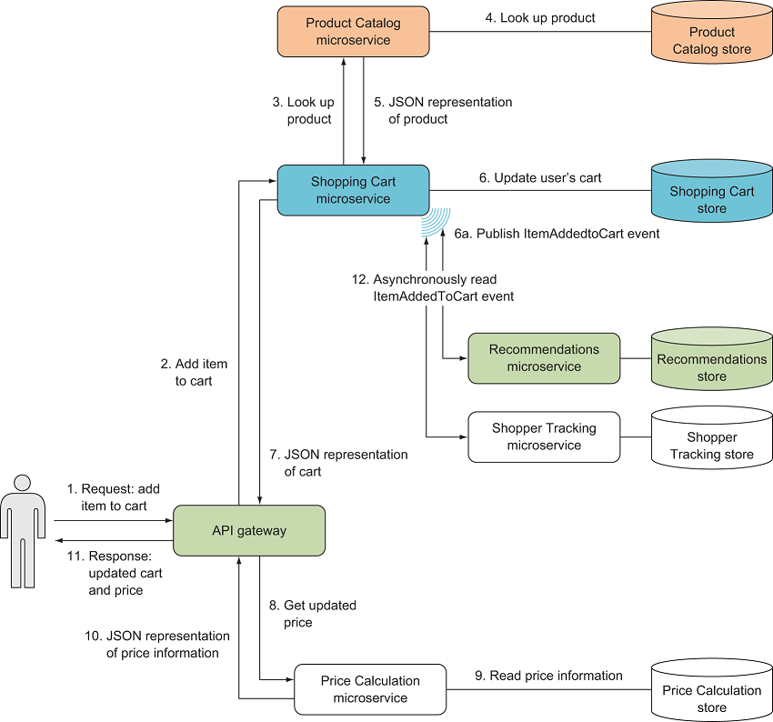

1. 微服务
   
   
   接收库存微服务公开了新库存到来时要使用的API。其他微服务可以如箭头所示调用该API。收货微服务负责将所有收货库存注册到数据存储中

+ 在其自己的单独流程中运行
+ 可以独立于其他微服务独立部署,亦可以独自部署集群
+ 有自己的专用数据存储
+ 与其他微服务合作以完成自己的操作

2. 服务之间不限语言
   
   不同的服务独立部署在自己的服务器上，他们相互之间除了调用不存在其他的关联，他们只需要知道如何相互交流即可。
   
   因此不同的服务之间可以使用不同的编程语言

3. 服务之间通信

+ 服务总线
+ grpc: 二进制
+ http

4. 微服务特点
   
+ 负责单一功能
  
  微服务负责整个系统中的一项功能
  
  比如：在电商系统中，订单服务只负责订单相关的服务，其他的比如用户相关的放到用户服务，购物车相关的放到购物车服务上。

+ 单独部署，并且可以单独部署集群
  
  当您更改特定的微服务时，您应该能够将更改后的微服务部署到生产环境，而无需部署（或接触）系统的任何其他部分。系统中的其他微服务应在更改的微服务部署期间继续运行并正常工作，并在部署新版本后继续运行

  比如：一个电子商务站点。每当对Shopping Cart微服务进行更改时，您都应该只能部署该微服务，如图1.2所示。同时，“价格计算”微服务，“推荐”微服务，“产品目录”微服务等应继续工作并满足用户的要求。

+ 微服务由一个或多个进程组成

在一个流程中运行一个以上的微服务会导致两者之间的高度耦合：它们无法单独部署，一个可能导致另一个的停机。

比如: 上图只改了cart-store 服务，但是部署会影响product catalog 服务的运行

+ 拥有自己的数据存储（分库）
  
  微服务拥有数据存储，在其中存储所需的数据。这是微服务的作用域具有完整功能的另一个结果。大多数业务功能都需要一些数据存储。例如，产品目录微服务需要有关每个产品的一些信息来存储。为了使产品目录与其他微服务保持松散耦合，包含产品信息的数据存储区完全归微服务所有。产品目录微服务决定如何以及何时存储产品信息

  其他微服务（例如购物车）只能通过与产品目录的接口访问产品信息，而不能直接从产品目录数据存储访问。

  

  **注意**

  > 微服务选择的数据库技术是实现的一部分，对其他微服务而言是隐藏的

5. 微服务的副作用可以通过异步来处理
   
   什么是副作用，比如用户下单时，要写的日志，跟踪等不是必须的影响系统运行的

   

6. 网关---统一处理和注册微服务接口的
   
  
7. 完整实例图
   
